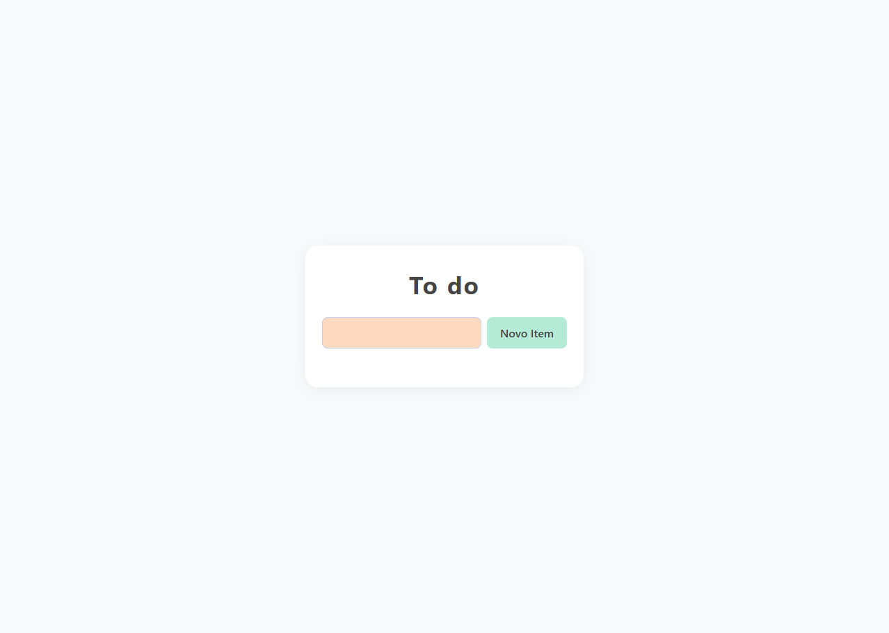

# 📝 Lista de Tarefas com JavaScript

Um projetinho simples e funcional feito com HTML, CSS e JavaScript puro.  
Permite adicionar, concluir e deletar tarefas de forma interativa!

---

## ✨ Funcionalidades

- ✅ Adicionar novas tarefas
- ✅ Marcar tarefas como concluídas (com risquinho)
- 🗑️ Deletar tarefas com um clique
- 🎨 Visual com paleta de cores personalizada

---

## 💡 Tecnologias usadas

- HTML5
- CSS3 (com variáveis no `:root`)
- JavaScript Vanilla (sem frameworks)

---

<!-- ## 📸 Preview

![screenshot do app]

--- -->

## 🚀 Como usar

1. Clone o repositório:
```bash
git clone https://github.com/seu-usuario/nome-do-repo.git
